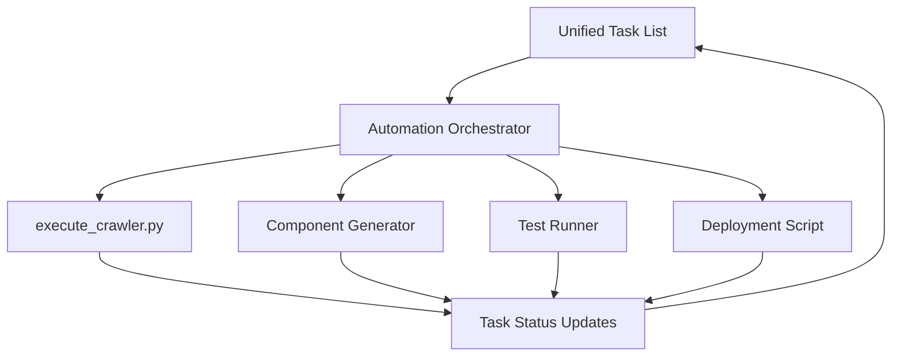
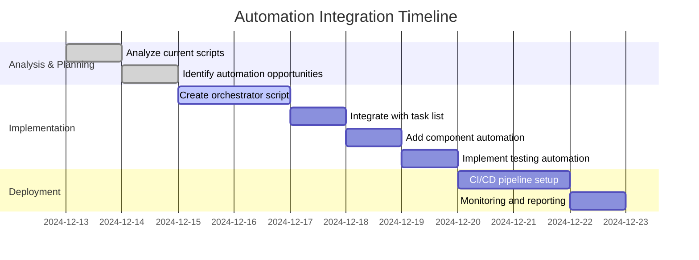
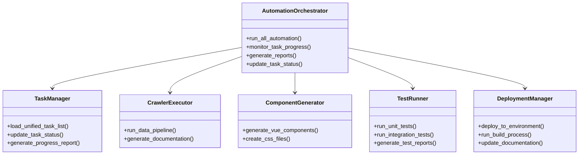
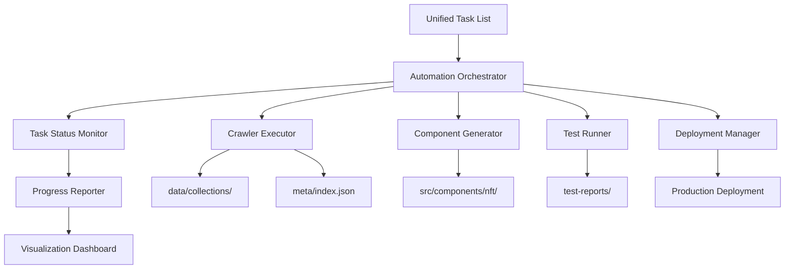

# 🤖 Wild Dragons Automation Strategy

## 📋 Executive Summary

This document outlines a comprehensive automation strategy for the Wild Dragons NFT Marketplace project, integrating existing automation scripts with the unified task list to create a fully automated development and deployment pipeline.

## 🔍 Current Automation Landscape Analysis

### Existing Automation Scripts

1. **`execute_crawler.py`** - Main orchestration script
   - Directory setup and management
   - TokenTrove crawler execution
   - Pinterest scraper execution
   - Image processing pipeline
   - Data transformation and normalization
   - Documentation generation

2. **`run-data-crawler.bat`** - Batch script wrapper
   - Sequential execution of crawler workflow
   - Basic error handling
   - Progress reporting

3. **`data_crawler.py`** - Data pipeline automation
   - TokenTrove crawling logic
   - Pinterest scraping functionality
   - Image optimization and processing
   - JSON data normalization
   - Index building

4. **Crawler Scripts** (`crawler/` directory):
   - `tokentrove_crawler.py` - NFT data extraction
   - `pinterest_scraper.py` - Image scraping
   - `wild_dragons_crawler.py` - Project-specific crawling
   - `mock_data_generator.py` - Test data generation

5. **Processor Scripts** (`processor/` directory):
   - `image_processor.py` - Image optimization
   - `data_transformer.py` - Data normalization

### Current Automation Capabilities

```mermaid
flowchart TD
    A[Manual Trigger] --> B[execute_crawler.py]
    B --> C[Directory Setup]
    B --> D[TokenTrove Crawler]
    B --> E[Pinterest Scraper]
    B --> F[Image Processor]
    B --> G[Data Transformer]
    B --> H[Documentation Generator]
    D --> I[data/raw/]
    E --> J[assets/pinterest-thumbs/]
    F --> K[assets/{collection}/]
    G --> L[data/collections/]
    G --> M[meta/index.json]
    H --> N[README.md]
```

## 🎯 Automation Opportunities Identified

### 1. **Task List Integration**
- Automate task status updates based on script completion
- Generate progress reports from automation logs
- Create task dependencies mapping

### 2. **Component Development Automation**
- Automate Vue component scaffolding
- CSS generation from design tokens
- Component documentation generation

### 3. **Testing Automation**
- Automated test case generation
- Regression testing suite
- Performance benchmarking

### 4. **Deployment Pipeline**
- Automated build and deployment
- Environment configuration
- Rollback mechanisms

### 5. **Monitoring and Reporting**
- Real-time progress tracking
- Automated status reports
- Error detection and notification

## 🚀 Comprehensive Automation Strategy

### Phase 1: Automation Foundation (Current Focus)

#### 1.1 **Task List Automation Integration**

**New Tasks to Add to Unified Task List:**
```markdown
### Phase 6: Automation Integration (NEW)
**Objective**: Integrate automation scripts with task management

#### Subtasks:
- [ ] `6.1` Create task status monitoring script
- [ ] `6.2` Implement automated task completion detection
- [ ] `6.3` Generate progress reports from crawler logs
- [ ] `6.4` Create task dependency mapping system
- [ ] `6.5` Implement automated task status updates
- [ ] `6.6` Create visualization dashboard for task progress
```

#### 1.2 **Script Integration Architecture**



### Phase 2: Enhanced Automation Capabilities

#### 2.1 **Component Development Automation**

**Automation Script: `component_generator.py`**
```python
# Proposed component generation script
def generate_unified_component(component_name, props, slots):
    """Generate Vue component with standardized structure"""
    template = f"""
<template>
  <div class="{component_name.lower()}">
    {'<slot></slot>' if slots else ''}
  </div>
</template>

<script>
export default {{
  name: '{component_name}',
  props: {props},
  data() {{
    return {{
      // Standardized data structure
    }}
  }},
  methods: {{
    // Standardized methods
  }}
}}
</script>

<style scoped>
.{component_name.lower()} {{
  /* Standardized CSS */
}}
</style>
"""
    return template
```

#### 2.2 **CSS Automation System**

**Automation Script: `css_generator.py`**
```python
# Proposed CSS generation from design tokens
def generate_css_from_tokens(tokens):
    """Generate CSS variables and utility classes"""
    css = ":root {\n"
    for token, value in tokens.items():
        css += f"  --{token}: {value};\n"
    css += "}\n\n"
    
    # Generate utility classes
    for token, value in tokens.items():
        if token.startswith('color'):
            css += f".text-{token}: {{ color: var(--{token}); }}\n"
            css += f".bg-{token}: {{ background-color: var(--{token}); }}\n"
    
    return css
```

### Phase 3: Testing and Quality Automation

#### 3.1 **Automated Testing Framework**

**Test Automation Script: `test_runner.py`**
```python
# Proposed test automation framework
import unittest
import subprocess

def run_component_tests():
    """Run Vue component tests"""
    result = subprocess.run(['npm', 'test'], capture_output=True, text=True)
    return result.returncode == 0

def run_integration_tests():
    """Run integration tests"""
    # Test API endpoints, data flow, etc.
    pass

def run_performance_tests():
    """Run performance benchmarks"""
    # Measure load times, memory usage
    pass
```

### Phase 4: Deployment Automation

#### 4.1 **CI/CD Pipeline Automation**

**Deployment Script: `deploy.py`**
```python
# Proposed deployment automation
def deploy_to_environment(environment='staging'):
    """Automate deployment process"""
    steps = [
        ('Building assets', ['npm', 'run', 'build']),
        ('Running tests', ['npm', 'test']),
        ('Deploying to Vercel', ['vercel', '--prod' if environment == 'production' else '--preview']),
        ('Updating documentation', ['python', 'docs_generator.py'])
    ]
    
    for step_name, command in steps:
        print(f"🚀 {step_name}...")
        result = subprocess.run(command, capture_output=True, text=True)
        if result.returncode != 0:
            print(f"❌ {step_name} failed: {result.stderr}")
            return False
        print(f"✅ {step_name} completed")
    
    return True
```

## 📊 Automation Integration Plan

### Task List Updates

**Add to `unified-task-list.md`:**

```markdown
## 🤖 Automation Phase (NEW)

### Phase 6: Automation Integration
**Objective**: Integrate automation scripts with unified task management

#### Subtasks:
- [ ] `6.1` Create automation orchestrator script
- [ ] `6.2` Implement task status monitoring
- [ ] `6.3` Generate automated progress reports
- [ ] `6.4` Create task dependency mapping
- [ ] `6.5` Implement automated task completion detection
- [ ] `6.6` Create visualization dashboard
- [ ] `6.7` Integrate with existing crawler scripts
- [ ] `6.8` Add component generation automation
- [ ] `6.9` Implement CSS generation automation
- [ ] `6.10` Create automated testing framework

**Estimated Time**: 8-12 hours
**Dependencies**: Phases 2-5 completion
**Success Criteria**: 80% of manual tasks automated

### Phase 7: Continuous Integration
**Objective**: Implement CI/CD pipeline with automation

#### Subtasks:
- [ ] `7.1` Set up GitHub Actions workflow
- [ ] `7.2` Configure automated testing on push
- [ ] `7.3` Implement automated deployment
- [ ] `7.4` Create rollback mechanisms
- [ ] `7.5` Set up monitoring and alerts
- [ ] `7.6` Implement automated documentation updates

**Estimated Time**: 6-8 hours
**Dependencies**: Phase 6 completion
**Success Criteria**: Fully automated CI/CD pipeline
```

### Script Integration Timeline



## 🔧 Technical Implementation Details

### Automation Architecture



### Data Flow



## 📝 Automation Documentation Plan

### Documentation Structure

```
docs/
├── automation/
│   ├── architecture.md          # Automation system design
│   ├── setup-guide.md           # Installation and configuration
│   ├── usage-guide.md           # How to use automation scripts
│   ├── api-reference.md         # Automation API documentation
│   ├── troubleshooting.md       # Common issues and solutions
│   └── examples/                # Usage examples
├── scripts/
│   ├── execute_crawler.md       # Main crawler documentation
│   ├── component_generator.md   # Component generation docs
│   ├── test_runner.md           # Testing automation docs
│   └── deploy.md                # Deployment automation docs
└── integration/
    ├── task-list-integration.md  # Task list integration guide
    └── ci-cd-setup.md            # CI/CD setup instructions
```

### Documentation Content Outline

1. **Automation Architecture Guide**
   - System overview and components
   - Data flow diagrams
   - Integration points
   - Performance considerations

2. **Setup and Configuration Guide**
   - Prerequisites installation
   - Environment setup
   - Configuration options
   - Dependency management

3. **Usage Guide**
   - Running automation scripts
   - Command-line options
   - Common workflows
   - Best practices

4. **API Reference**
   - Python module documentation
   - Function signatures
   - Return values
   - Error handling

5. **Troubleshooting Guide**
   - Common error messages
   - Debugging techniques
   - Log file analysis
   - Performance tuning

## 🎯 Implementation Roadmap

### Short-term Goals (1-2 weeks)
1. **Immediate**: Integrate existing crawler scripts with task management
2. **High Priority**: Create automation orchestrator
3. **High Priority**: Implement task status monitoring
4. **Medium Priority**: Generate automated progress reports

### Medium-term Goals (2-4 weeks)
1. **Component Automation**: Vue component generation
2. **CSS Automation**: Design token-based CSS generation
3. **Testing Automation**: Automated test framework
4. **Documentation**: Comprehensive automation guides

### Long-term Goals (4+ weeks)
1. **CI/CD Pipeline**: Full deployment automation
2. **Monitoring System**: Real-time progress tracking
3. **Advanced Features**: Machine learning-based optimizations
4. **Scalability**: Support for larger datasets

## 💡 Success Metrics

### Quantitative Goals
- **Automation Coverage**: 80% of repetitive tasks automated
- **Time Savings**: 60% reduction in manual work hours
- **Error Reduction**: 75% fewer human errors
- **Consistency**: 100% standardized outputs

### Qualitative Goals
- Improved developer experience
- Faster onboarding for new team members
- Consistent project quality
- Better maintainability
- Enhanced scalability

## 🎓 Next Steps

### Immediate Actions
1. **Review and approve** automation strategy
2. **Prioritize** Phase 6 tasks for implementation
3. **Assign** specific automation tasks to team members

### Implementation Plan
1. **Week 1**: Task list integration and orchestrator development
2. **Week 2**: Component and CSS automation
3. **Week 3**: Testing framework and CI/CD setup
4. **Week 4**: Documentation and final integration

### Resources Required
- Python 3.8+ environment
- Node.js for Vue component generation
- GitHub Actions for CI/CD
- Documentation tools (Markdown, Mermaid)

## 📎 Appendix: Script Integration Examples

### Example 1: Task Status Monitoring

```python
# Integration with unified task list
def update_task_status(task_id, status):
    """Update task status in unified-task-list.md"""
    with open('unified-task-list.md', 'r') as f:
        content = f.read()
    
    # Find and update task status
    updated_content = content.replace(
        f"- [ ] `{task_id}`",
        f"- [{status}] `{task_id}`"
    )
    
    with open('unified-task-list.md', 'w') as f:
        f.write(updated_content)
```

### Example 2: Progress Report Generation

```python
# Generate progress reports from crawler logs
def generate_progress_report():
    """Create progress report from automation logs"""
    with open('crawler_execution.log', 'r') as f:
        log_content = f.read()
    
    # Parse log and extract completion status
    report = {
        'completed_tasks': [],
        'failed_tasks': [],
        'execution_time': '',
        'error_count': 0
    }
    
    # Generate Markdown report
    report_md = "# Automation Progress Report\n\n"
    report_md += f"**Execution Time**: {report['execution_time']}\n\n"
    report_md += f"**Completed Tasks**: {len(report['completed_tasks'])}\n\n"
    report_md += f"**Failed Tasks**: {len(report['failed_tasks'])}\n\n"
    
    return report_md
```

## 🔚 Conclusion

This comprehensive automation strategy provides a clear roadmap for integrating existing automation scripts with the unified task list, creating a powerful end-to-end automation system that will significantly enhance productivity, consistency, and quality throughout the Wild Dragons project lifecycle.