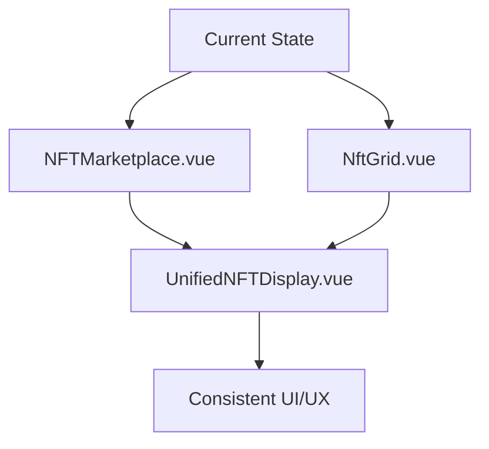
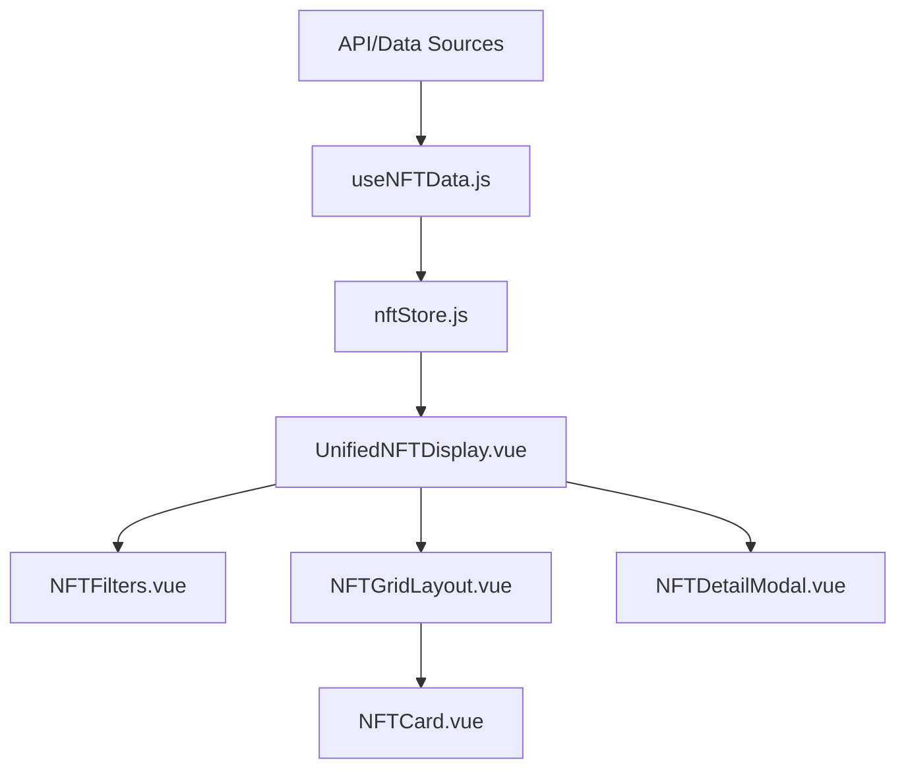

# Wild Dragons Project Analysis and Unified Display Strategy

## Current Project Structure Analysis

### 1. Project Organization
The project follows a well-structured Vue.js application with the following key components:

- **src/components/**: Contains reusable components like `NFTMarketplace.vue` and `NftGrid.vue`
- **src/pages/**: Contains route-specific pages like `Connect.vue`, `Marketplace/` components
- **src/views/**: Contains main views like `HomePage.vue`
- **data/collections/**: JSON files for NFT collections
- **meta/**: Master index file linking all collections
- **assets/**: Image assets organized by collection
- **src/assets/css/**: CSS files including `nft.css` and `styles.css`

### 2. Display Inconsistencies Identified

#### A. Duplicate Components
- `NFTMarketplace.vue` and `NftGrid.vue` serve similar purposes with overlapping functionality
- Both components have similar filtering logic, modal displays, and NFT card layouts
- This creates maintenance overhead and potential for divergence

#### B. Styling Inconsistencies
- `NFTMarketplace.vue` uses inline styles and some Tailwind classes
- `NftGrid.vue` uses a mix of Tailwind and custom CSS classes
- `nft.css` defines styles that aren't consistently applied across components
- Some components use different class naming conventions

#### C. Data Loading Redundancy
- Both marketplace components implement similar data loading logic
- Error handling and fallback to mock data is duplicated
- Collection filtering logic is repeated

#### D. Modal Implementation Differences
- `NFTMarketplace.vue` has a more detailed modal with spiritual attributes
- `NftGrid.vue` has a simpler modal layout
- Different styling approaches for the same conceptual element

### 3. Unified Display Strategy

#### A. Component Consolidation


#### B. Standardized Component Structure

**Proposed Unified Component: `UnifiedNFTDisplay.vue`**

```vue
<!-- UnifiedNFTDisplay.vue -->
<template>
  <div class="nft-display-container">
    <!-- Standardized Filters Section -->
    <NFTFilters 
      :collections="collections"
      :elements="elements"
      :rarities="rarityLevels"
      @filter-change="handleFilterChange"
    />
    
    <!-- Standardized Grid Layout -->
    <NFTGridLayout 
      :nfts="filteredNFTs"
      :loading="loading"
      @select-nft="showNFTDetail"
    />
    
    <!-- Standardized Modal -->
    <NFTDetailModal 
      :nft="selectedNFT"
      @close="selectedNFT = null"
    />
  </div>
</template>
```

#### C. CSS Standardization

**Unified CSS Approach:**
- Consolidate all NFT-related styles into `nft.css`
- Use consistent BEM-like naming convention
- Standardize color scheme and spacing
- Create reusable utility classes

```css
/* Standardized NFT Card */
.nft-card {
  background: var(--nft-card-bg, #181828);
  border: 1.5px solid var(--nft-border, #00fff7);
  border-radius: var(--nft-radius, 12px);
  transition: all 0.2s ease;
}

.nft-card:hover {
  border-color: var(--nft-hover-border, #ff00cc);
  transform: translateY(-4px);
}
```

### 4. Structured Task List

#### Phase 1: Analysis and Planning (Current Phase)
- [x] Analyze current project structure
- [x] Identify display inconsistencies
- [x] Create unified display strategy
- [ ] Document current component relationships
- [ ] Create migration plan

#### Phase 2: Component Consolidation
- [ ] Create `UnifiedNFTDisplay.vue` component
- [ ] Extract `NFTFilters.vue` subcomponent
- [ ] Extract `NFTGridLayout.vue` subcomponent  
- [ ] Extract `NFTDetailModal.vue` subcomponent
- [ ] Implement standardized props and events
- [ ] Update all parent components to use unified component

#### Phase 3: CSS Standardization
- [ ] Audit all existing NFT-related styles
- [ ] Create unified CSS variable system
- [ ] Standardize component classes
- [ ] Implement responsive design consistency
- [ ] Test across all viewports

#### Phase 4: Data Layer Unification
- [ ] Create centralized NFT data service
- [ ] Standardize data loading and error handling
- [ ] Implement caching strategy
- [ ] Create consistent mock data fallback

#### Phase 5: Testing and Validation
- [ ] Create comprehensive test cases
- [ ] Test component functionality
- [ ] Validate responsive behavior
- [ ] Performance testing
- [ ] User acceptance testing

### 5. Missing Components Identified

#### A. Centralized State Management
- No centralized store for NFT data
- Each component manages its own state
- Filtering logic is duplicated

#### B. Error Boundary Components
- No consistent error handling UI
- Missing loading states in some components
- No global error boundary

#### C. Accessibility Features
- Missing ARIA attributes
- No keyboard navigation support
- Inconsistent focus management

#### D. Performance Optimization
- No image lazy loading in all components
- Missing virtual scrolling for large collections
- No component memoization

### 6. Organization Recommendations

#### A. Component Structure
```
src/
├── components/
│   ├── nft/
│   │   ├── UnifiedNFTDisplay.vue      # Main component
│   │   ├── NFTFilters.vue             # Filter controls
│   │   ├── NFTGridLayout.vue          # Grid display
│   │   ├── NFTDetailModal.vue         # Detail modal
│   │   └── NFTCard.vue                # Individual card
│   └── ui/                           # UI primitives
├── composables/
│   └── useNFTData.js                 # Data logic
└── stores/
    └── nftStore.js                   # Centralized state
```

#### B. CSS Organization
```
src/assets/css/
├── variables.css        # CSS variables and design tokens
├── utilities.css        # Utility classes
├── components/
│   ├── nft-card.css     # Component-specific styles
│   ├── filters.css      # Filter styles
│   └── modal.css        # Modal styles
└── main.css             # Main entry point
```

#### C. Data Flow Architecture


#### D. Implementation Priority

1. **High Priority**: Component consolidation and CSS standardization
2. **Medium Priority**: Centralized state management and data service
3. **Low Priority**: Performance optimization and accessibility enhancements

## Next Steps

1. **Immediate**: Finalize unified component design and get approval
2. **Short-term**: Implement component consolidation
3. **Mid-term**: Standardize CSS and create design system
4. **Long-term**: Implement centralized state management and performance optimizations

## Recommendations

1. **Adopt Atomic Design**: Break down components into atoms, molecules, organisms
2. **Implement Storybook**: For component documentation and testing
3. **Create Design System**: Standardize colors, typography, spacing
4. **Implement CI/CD**: Automated testing and deployment pipeline
5. **Add Documentation**: Component props, usage examples, and guidelines