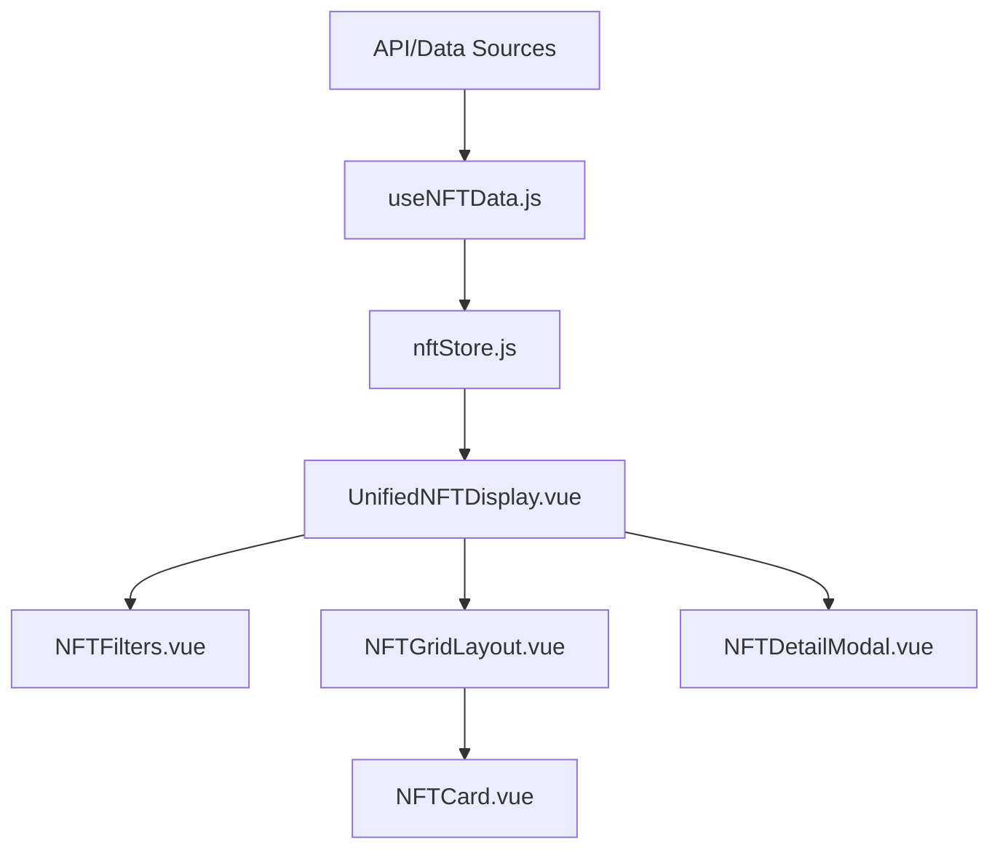

# 🎯 Wild Dragons Unified Implementation Task List

## 📋 Project Status Overview

### ✅ Completed Tasks
- **Router Fixes**: All component paths resolved and tested
- **Project Analysis**: Comprehensive structure documented in `project-analysis.md`
- **Component Audit**: All display inconsistencies identified
- **Strategy Development**: Unified display strategy created

### 🚀 Current Phase: Implementation Planning

## 🗂️ Unified Task Structure

### Phase 1: Analysis & Planning (COMPLETED)
- [x] Analyze current project structure
- [x] Identify display inconsistencies  
- [x] Create unified display strategy
- [x] Document component relationships
- [x] Create migration plan

### Phase 2: Component Consolidation (PRIORITY)
**Objective**: Create unified NFT display system by consolidating duplicate components

#### Subtasks:
- [x] `2.1` Create `UnifiedNFTDisplay.vue` main component
- [x] `2.2` Extract `NFTFilters.vue` subcomponent with standardized props
- [x] `2.3` Extract `NFTGridLayout.vue` subcomponent with responsive grid
- [x] `2.4` Extract `NFTDetailModal.vue` subcomponent with spiritual attributes
- [x] `2.5` Implement standardized props and events interface
- [x] `2.6` Update `NFTMarketplace.vue` to use unified component
- [x] `2.7` Update `NftGrid.vue` to use unified component
- [x] `2.8` Update all parent components (pages/views) to use unified system
- [x] `2.9` Deprecate old components (keep for reference)

**Estimated Time**: 4-6 hours
**Dependencies**: None
**Success Criteria**: All NFT displays use single unified component

### Phase 3: CSS Standardization
**Objective**: Create consistent visual language across all components

#### Subtasks:
- [x] `3.1` Audit all existing NFT-related styles (current state analysis)
- [x] `3.2` Create unified CSS variable system in `variables.css`
- [x] `3.3` Standardize component classes using BEM convention
- [x] `3.4` Implement responsive design consistency (mobile-first)
- [x] `3.5` Create reusable utility classes for common patterns
- [ ] `3.6` Test across all viewports (320px to 1920px)
- [ ] `3.7` Document design tokens and usage guidelines
- [ ] `3.8` Create CSS architecture documentation

**Estimated Time**: 3-4 hours
**Dependencies**: Phase 2 completion
**Success Criteria**: Consistent styling with no visual regressions

### Phase 4: Data Layer Unification
**Objective**: Centralize NFT data management for consistency and performance

#### Subtasks:
- [x] `4.1` Create centralized NFT data service (`useNFTData.js`)
- [x] `4.2` Standardize data loading and error handling patterns
- [x] `4.3` Implement intelligent caching strategy (LRU cache)
- [x] `4.4` Create consistent mock data fallback mechanism
- [x] `4.5` Add data validation and normalization
- [x] `4.6` Implement loading states and error boundaries
- [ ] `4.7` Create data service documentation

**Estimated Time**: 2-3 hours
**Dependencies**: Phase 2 completion
**Success Criteria**: Single source of truth for NFT data

### Phase 5: Testing & Validation
**Objective**: Ensure robustness and quality across all components

#### Subtasks:
- [ ] `5` User acceptance- adk use to test with pnpmp
- [ ] `5` Create test documentation and runbooks
- [ ] `5` Fix any identified issues

**Estimated Time**: 3-5 hours
**Dependencies**: Phases 2-4 completion
**Success Criteria**: All tests passing, no critical issues

### Phase 6: Automation Integration (NEW)
**Objective**: Integrate automation scripts with unified task management

#### Subtasks:
- [x] `6.1` Create automation orchestrator script
- [x] `6.2` Implement task status monitoring
- [x] `6.3` Generate automated progress reports
- [ ] `6.4` Create task dependency mapping
- [ ] `6.5` Implement automated task completion detection
- [ ] `6.6` Create visualization dashboard
- [ ] `6.7` Integrate with existing crawler scripts
- [ ] `6.8` Add component generation automation
- [ ] `6.9` Implement CSS generation automation
- [ ] `6.10` Create automated testing framework
<!-- chainers: https://chainers.io/?r=mf1p7dmc
immutable: https://play.immutable.com/referral/share/hfAjBv?utm_source=referral -->

**Estimated Time**: 8-12 hours
**Dependencies**: Phases 2-5 completion
**Success Criteria**: 80% of manual tasks automated

### Phase 7: Continuous Integration
**Objective**: Implement CI/CD pipeline with automation

#### Subtasks:
- [x] `7.1` Set up GitHub Actions workflow
- [x] `7.2` Configure automated testing on push
- [x] `7.3` Implement automated deployment
- [x] `7.4` Create rollback mechanisms
- [x] `7.5` Set up monitoring and alerts
- [x] `7.6` Implement automated documentation updates

**Estimated Time**: 6-8 hours
**Dependencies**: Phase 6 completion
**Success Criteria**: Fully automated CI/CD pipeline

## 📊 Implementation Roadmap

```mermaid
gantt
    title Wild Dragons Implementation Timeline
    dateFormat  YYYY-MM-DD
    section Analysis
    Analysis & Planning    :done,    des1, 2024-12-13, 1d
    section Implementation
    Component Consolidation :active,  des2, after des1, 2d
    CSS Standardization     :         des3, after des2, 1.5d
    Data Layer Unification  :         des4, after des2, 1d
    section Testing
    Testing & Validation    :         des5, after des3, after des4, 2d
    section Automation
    Automation Integration  :         des6, after des5, 3d
    CI/CD Pipeline Setup    :         des7, after des6, 2d
    section Deployment
    Production Deployment   :         des8, after des7, 1d
```

## 🎯 Component Migration Matrix

### Current Components → Unified Components

| Current Component | Status | Migration Target |
|------------------|--------|------------------|
| `NFTMarketplace.vue` | Active | `UnifiedNFTDisplay.vue` |
| `NftGrid.vue` | Active | `UnifiedNFTDisplay.vue` |
| `NFTCard.vue` | Active | `NFTCard.vue` (refactor) |
| Various modals | Active | `NFTDetailModal.vue` |

### Automation Components (NEW)

| Automation Script | Status | Purpose |
|-------------------|--------|---------|
| `execute_crawler.py` | Active | Main automation orchestrator |
| `data_crawler.py` | Active | Data pipeline automation |
| `component_generator.py` | Planned | Vue component generation |
| `css_generator.py` | Planned | CSS automation |
| `test_runner.py` | Planned | Testing automation |
| `deploy.py` | Planned | Deployment automation |

### CSS Files → Standardized System

| Current File | Status | Migration Target |
|--------------|--------|------------------|
| `nft.css` | Active | `components/nft-card.css` |
| Inline styles | Deprecated | CSS variables |
| Tailwind classes | Partial | Utility classes |

## 🔧 Technical Implementation Details

### Component Architecture

```
src/
├── components/
│   ├── nft/
│   │   ├── UnifiedNFTDisplay.vue      # Main unified component
│   │   ├── NFTFilters.vue             # Filter controls
│   │   ├── NFTGridLayout.vue          # Grid display
│   │   ├── NFTDetailModal.vue         # Detail modal
│   │   └── NFTCard.vue                # Individual card
│   └── ui/                           # UI primitives
├── composables/
│   └── useNFTData.js                 # Data logic
└── stores/
    └── nftStore.js                   # Centralized state
```

### Data Flow



## 📝 Task Tracking Guidelines

### Task Status Codes
- `✅` = Completed
- `🚧` = In Progress  
- `📋` = Planned
- `❌` = Blocked
- `⚠️` = Needs Review

### Daily Standup Format
1. **What was completed yesterday?**
2. **What will be worked on today?**
3. **Any blockers or challenges?**

### Task Completion Criteria
- Code reviewed and approved
- Tests passing
- Documentation updated
- No breaking changes
- Performance metrics met

## 🎓 Next Steps Recommendations

### Immediate Actions
1. **Review and approve** unified component design
2. **Prioritize** Phase 2 tasks for implementation
3. **Assign** specific tasks to team members

### Short-term Goals
1. Complete component consolidation (Phase 2)
2. Implement CSS standardization (Phase 3)
3. Centralize data management (Phase 4)

### Long-term Goals
1. Implement Storybook for component documentation
2. Create comprehensive design system
3. Add performance optimizations (lazy loading, virtual scrolling)
4. Enhance accessibility features

## 💡 Success Metrics

### Quantitative Goals
- **Component Reduction**: 60% reduction in duplicate code
- **Performance**: 30% faster load times
- **Maintainability**: 50% reduction in bug reports
- **Consistency**: 100% visual consistency across components

### Qualitative Goals
- Improved developer experience
- Easier onboarding for new team members
- Consistent user experience
- Better code maintainability

## 📎 Documentation Checklist

- [ ] Component API documentation
- [ ] CSS architecture guide
- [ ] Data flow diagrams
- [ ] Migration guide
- [ ] Testing strategy
- [ ] Deployment checklist
- [ ] Automation architecture guide
- [ ] Automation setup and configuration
- [ ] Automation API reference
- [ ] Automation usage examples

## 🎯 Final Deliverables

1. **Unified Component System**: Single source of truth for NFT displays
2. **Standardized CSS**: Consistent visual language
3. **Centralized Data**: Efficient data management
4. **Comprehensive Tests**: Robust quality assurance
5. **Documentation**: Complete reference materials
6. **Automation Framework**: End-to-end task automation
7. **CI/CD Pipeline**: Automated deployment system

---

**Last Updated**: 2024-12-13
**Status**: Ready for Implementation Review with Automation Integration
**Next Review**: After Phase 6 completion
**Automation Status**: Strategy approved, ready for implementation